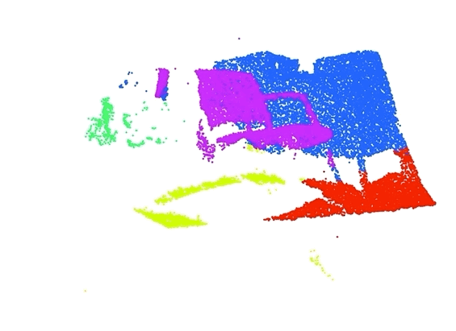

# Expectation Maximization

<p align="center">
 <br />

 
</p>

# Setup
Create new conda environment for this assignment.
```
conda env create -f ai_a5_env.yml
```

Activate environment with,
```
conda activate ai_a5_env
```

#### Jupyter Notebook:
You will be using **jupyter notebook** to complete this assignment. 

To open the jupyter notebook, navigate to your assignment folder, activate the conda environment `conda activate ai_a5_env`, and run `jupyter notebook`. 

Project description and all of the functions that you will implement are in `solution.ipynb` file.

**ATTENTION:** You are free to add additional cells for debugging your implementation, however, please don't write any inline code in the cells with function declarations, only edit the section *inside* the function, which has comments like: `# TODO: finish this function`.

## Resources

1. Canvas lectures on Unsupervised Learning (Lesson 7)
2. The `gaussians.pdf`  in the `read/` folder will introduce you to multivariate normal distributions.
3. A youtube video by Alexander Ihler, on multivariate EM algorithm details:
[https://www.youtube.com/watch?v=qMTuMa86NzU](https://www.youtube.com/watch?v=qMTuMa86NzU)
4. The `em.pdf` chapter in the `read/` folder. This will be especially useful for Part 2 of the assignment.
5. Numpy and vectorization related
    * [Stackexchange discussion](https://softwareengineering.stackexchange.com/questions/254475/how-do-i-move-away-from-the-for-loop-school-of-thought)
    * [Hackernoon article](https://hackernoon.com/speeding-up-your-code-2-vectorizing-the-loops-with-numpy-e380e939bed3)
    * [Numpy einsum](https://numpy.org/doc/stable/reference/generated/numpy.einsum.html) (highly recommended)
    * [Slicing and indexing](http://scipy-lectures.org/intro/numpy/array_object.html#indexing-and-slicing)
    * [Copies and views](http://scipy-lectures.org/intro/numpy/array_object.html#copies-and-views)
    * [Fancy indexing](http://scipy-lectures.org/intro/numpy/array_object.html#fancy-indexing)

